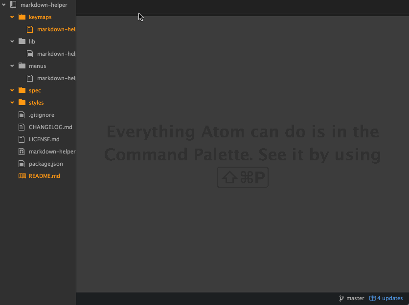

# markdown-helper package

Markdown-helper doesnt render your pages as markdown, it simply provides the ability to override the opener for markdown files, delegating responsibility to another command. By default, we use *markdown-preview* to render markdown as it is selected. However, you are free to override the package protocol and supported formats.

Using this is as simple as, well, markdown itself. Simply toggle the command on ( markdown-helper:toggle ) and then any newly selected markdown files will be previewed automatically.

